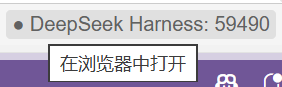

# DeepSeek Harness for VSCode Unofficial

[中文](README.md) | **English**

> ⚠️ **Unofficial extension**: maintained by community developers, **not affiliated with DeepSeek AI or its official products**, and not published, endorsed, or supported by DeepSeek.

An unofficial client that brings [DeepSeek Harness](https://github.com/deepseek-ai/deepseek-harness) (`dsh`, DeepSeek's open-source AI coding agent framework) into the VS Code sidebar.

Two sidebar UIs (switch with `dsh.ui.mode`):

- **embedded (default)**: embeds dsh's official Web UI in a sidebar iframe — full feature set
- **native**: a custom chat UI built on the official JSON-RPC SDK — native VS Code feel

## Quick Start

### 1. Install

Extensions panel → `...` → **Install from VSIX** → pick `dsh-vscode-0.1.0.vsix` from the [Releases](https://github.com/Mu-X-Yun/deepseek-harness-for-vscode-unofficial/releases) page.

### 2. Open the Sidebar

Click the **DSH whale icon** in the activity bar. The first launch auto-installs the dsh runtime and starts it (progress is shown; roughly a minute). Afterwards, Reload / restarts open instantly (the running dsh is reused).

The status bar shows the dsh service state and port; click it to open the full UI in an external browser:



### 3. Configure the API Key

Settings (`Ctrl+,`) → search `dsh.deepseekApiKey` → enter your DeepSeek API Key (or let the extension inherit `DEEPSEEK_API_KEY` from the host environment).

### 4. Start Chatting

Type a question in the sidebar to converse with the dsh agent (embedded mode gives the full official Web UI: sessions, tool calls, model selection, and more).

**Add the current workspace to dsh workspaces**: click the **Add workspace** button in the sidebar footer to adopt the folder currently open in VS Code (sessions then belong to that workspace):


Other commands (Command Palette `Ctrl+Shift+P`):

| Command | Description |
|---|---|
| `DSH: Open in Secondary Sidebar` | Open in the right-side secondary sidebar (both can be shown, state synced) |
| `DSH: Open in browser` | Open the full UI in an external browser |
| `DSH: Show server logs` | View dsh process and extension logs (troubleshooting) |
| `DSH: Stop server` | Stop the dsh server |

## Relationship with Official DeepSeek Harness (dsh)

This extension is a **third-party VS Code client** for the official [DeepSeek Harness](https://github.com/deepseek-ai/deepseek-harness) (`dsh`, an MIT-licensed open-source project by DeepSeek AI):

- **No official source code included or modified**: the extension contains no dsh code and applies no patches; dsh's source, copyright, and release belong to DeepSeek AI.
- **How it drives dsh**: the extension starts the dsh installed on your machine (auto-installed, globally installed, or a source checkout) and drives it through public interfaces:
  - **embedded mode**: spawns `dsh web` and embeds the official Web UI in a sidebar iframe (the UI itself is dsh's official UI)
  - **native mode**: drives the dsh runtime via the official JSON-RPC SDK (`@deepseek-ai/dsh-sdk-client`)
- **You provide**: a DeepSeek API Key (the dsh runtime can be auto-installed by the extension).
- **Upstream dependency**: dsh is in developer preview (0.1.0-rc.x); upstream updates may change behavior and affect this extension — out of this project's control.

## Getting the dsh Runtime (three options)

`dsh.runtime.mode` decides where the dsh runtime comes from:

| Mode | Description | Best for |
|---|---|---|
| `auto-install` (default) | First launch runs `npm install @deepseek-ai/dsh` into the extension storage; reused afterwards | Out-of-the-box (recommended) |
| `installed` | **Auto-detects** an installed dsh: global install (`npm i -g @deepseek-ai/dsh`) or the npx cache (after running `npx @deepseek-ai/dsh web` once); `dsh.runtime.path` can override | Users who already have dsh |
| `repo` | Runs from the `deepseek-harness-master` source checkout | Developing/debugging dsh itself |

Default `auto-install` works for most users; switch to `installed` to reuse an existing dsh:
```sh
npm i -g @deepseek-ai/dsh   # then set dsh.runtime.mode: installed
```

> ℹ️ **Mode applicability**: `installed` / `auto-install` support **embedded mode** (the npm package runs `dsh web` fully; verified). **native mode** currently requires `repo` — the upstream npm package (`dsh-sdk-jsonrpc-demo`) does not bundle the cordis.yml plugin dependencies (llm-deepseek, agent-spine, etc.), so it cannot run standalone in npm form.

## Settings

| Setting | Default | Description |
|---|---|---|
| `dsh.deepseekApiKey` | (inherit env) | DeepSeek API Key, injected into the spawn environment |
| `dsh.deepseekBaseUrl` | — | Optional custom endpoint; only honored from the process environment |
| `dsh.runtime.mode` | `auto-install` | `auto-install` / `installed` (detect global/npx) / `repo` (source checkout) |
| `dsh.runtime.path` | auto-detect | Absolute runtime path (repo checkout or a node_modules root containing dsh) |
| `dsh.runtime.nodePath` | `node` (PATH) | Node executable used to spawn dsh. **Must be the system Node** (`process.execPath` points at Code.exe in the extension host, whose bundled node breaks tsx's tsconfig-paths resolution) |
| `dsh.permissionMode` | `workspace-write` | Injected as `DSH_PERMISSION_MODE` |
| `dsh.model` | `deepseek-v4-flash` | Default model for new sessions |
| `dsh.ui.mode` | `embedded` | Sidebar UI: `embedded` (iframe) / `native` (custom chat UI) |

## Prerequisites

- VS Code `^1.85.0`
- Node.js `^22.19 || >=24` (dsh's engine requirement)
- pnpm (repo mode only: building dsh from source)

## Known Limitations

- dsh is in developer preview (0.1.0-rc.x); compatibility may change; the extension pins its version.
- The embedded UI is dsh's own Web UI — its theme does not fully match VS Code (native mode addresses this).
- The embedded iframe captures keyboard focus; some VS Code shortcuts are unavailable inside the chat area.
- In native mode, `stopAgent` terminates and rebuilds the runtime (the protocol has no mid-turn cancel; in-flight progress is lost); session history after an extension restart is read-only (no session resume in the protocol).
- Native mode has no interactive permission prompts (no permission-request method in the JSON-RPC protocol); under `dsh.permissionMode: workspace-write` dangerous commands are effectively denied — switch to `danger-full-access` to allow them.
- The dsh process stays running after VS Code closes (so next start is instant); use `DSH: Stop server` to stop it manually.

## Architecture Highlights

- **Process ownership**: `dsh web` (embedded) and `dsh-jsonrpc-agent` (native) children are owned by the Extension Host and survive sidebar view disposal; **reused across Reloads** (state persisted to extension storage, health-checked for instant reuse); on Windows, teardown uses `taskkill /T /F` on the process tree.
- **Readiness detection**: embedded mode parses dsh stdout for the `dsh web: http://127.0.0.1:<port>` ready line (`--port 0` = random port) instead of port polling.
- **State sync**: host broadcast + webview ready handshake + 15s poll fallback — any lost state push self-heals.
- **Embed security**: the iframe and the dsh service are same-origin (127.0.0.1), passing dsh's browser-trust fence; the server sets no CSP / X-Frame-Options, so embedding is not blocked.
- **Key injection**: `DEEPSEEK_API_KEY` / `DEEPSEEK_BASE_URL` / `DSH_*` are injected only via the spawn environment — matching dsh's BOOTSTRAP constraints (forbidden from `.env`).
- **Dependency fix**: npm sharp 0.35.3 is a broken release (binary fails to load); the extension pins 0.35.2 via npm overrides (auto-install handles it; installed mode detects and advises).
- **Native runtime**: `dsh-jsonrpc-agent` launches from the repo via tsx (`node --import tsx/esm`); the generated cordis.yml lives in extension global storage, resolving plugins through a Windows junction to `examples/node_modules` (same mechanism as dsh's `healProfilesModuleFallback`).
- **Native event stream**: `DeepSeekHarness` owns the subprocess; `HarnessClient.subscribe()` streams `session.event` / `session.status` / `subagent.*` notifications; the renderer follows the wire structure (envelope `data` field) with streaming folding, seq dedup, and compaction replay.

## Development (repo mode)

The extension runs dsh from the `deepseek-harness-master/` source checkout (auto-detected as a sibling directory of the extension; `dsh.runtime.path` can override):

```sh
# 1. Prepare the dsh source once
cd deepseek-harness-master
pnpm install
pnpm run build:lib:host && pnpm run build:lib:client   # or pnpm run build
pnpm run build:web          # produces apps/web/dist; dsh fails to start without it

# 2. Install and launch the extension (F5, Extension Development Host)
cd dsh-vscode
npm install
npm run watch               # esbuild watch (launch.json's preLaunchTask runs it)
```

## Testing

```sh
npm test    # vitest: renderer/parser/runtime-detection unit tests + SDK handshake + real-chat e2e (skipped without a key)
```
`tests/native-chat.e2e.spec.ts` runs a full conversation against the real API (requires the `DEEPSEEK_API_KEY` environment variable).

## Packaging

```sh
npm run package    # esbuild build + vsce package → dsh-vscode-0.1.0.vsix
```
The VSIX does not bundle the dsh runtime (`auto-install` mode installs it into the extension storage on first launch).

## License

[MIT](LICENSE) — this project (the extension itself) is an independent open-source project. Note: DeepSeek Harness (`dsh`) is an MIT-licensed project by [DeepSeek AI](https://github.com/deepseek-ai/deepseek-harness); this extension is merely its external driver client and contains none of its source.
